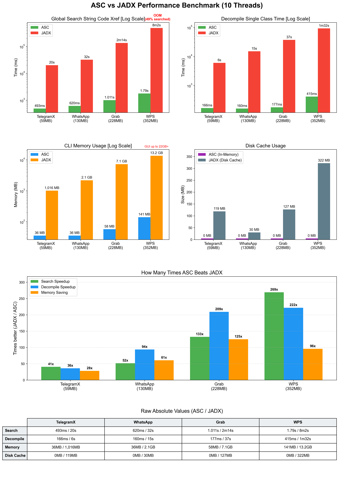

# Droid ASC: R8 Compiler Optimization as a DeCompiler Primitive
https://blackhat.com/europe/arsenal/schedule/index.html#droid-asc-r8-compiler-optimization-as-a-decompiler-primitive-54834  

When decompiling massive Android APKs, the standard procedure is to wait. We wait for tools to eat gigabytes of RAM, fully inflate the artifacts, and spend tens of minutes building heavy global indexes and cross references... All of this is just to guarantee fast code searches later, but here is the contradiction. A compiled artifact is already highly structured, modern decompilers never utilize this, they waste massive amounts of time and memory reconstructing a bloated database of code relationships over already structured data. This engineering approach defies common sense. When I can directly extract any code relationship from the APK in milliseconds, does this preprocessing still hold any value?  

Instead of forcing decompilers into heavy preprocessing, we choose to query the compiled artifact directly as a database. We built a stateless, zero-overhead engine that extracts and searches code on demand in milliseconds. In this briefing, we will explore the underlying engineering required to bypass traditional bottlenecks. We will demonstrate how to abandon full inflate by probing directly within the Deflate bitstream, building dense Huffman lookup tables to extract core metadata without touching irrelevant data blocks. Furthermore, we will explain optimization details of the R8 compiler, especially how deterministic constant relocation and instruction deduplication leave behind highly concentrated physical layouts, we weaponize this compiler behavior to execute lightning-fast cross DEX code searches. To map these raw bytecode offsets back to methods, we engineered an O(1) instruction locating primitive, achieving constant-time method resolution without building heavy mapping tables. Finally, upon hitting a target, Droid ASC extracts only the specific bytecodes and its dependencies, dynamically reconstructing a minimal and self consistent DEX entirely in memory for instant decompilation.  

We will demonstrate this architecture live against a 352MB commercial APK. Droid ASC executes global cross reference searches in 1.79 seconds and decompiles target classes in 177 milliseconds using only 141MB of RAM. By treating the artifact as a read only database and operating with zero preprocessing, we return the decompiler to its core essence. It is no longer a bloated indexing tool, but a lightning fast, on demand decompilation engine that fundamentally redefines how we analyze compiled code.  

# Benchmark

[ASC_Benchmark.mp4](https://github.com/MG1937/ASC/blob/main/docs/ASC_Benchmark.mp4)

https://github.com/user-attachments/assets/4c4a6813-8561-490c-a573-ef113da861b6

# How to use
```
usage: main.py [-h] {getclass,findrefs} ...

ASC tooling entry.

positional arguments:
  {getclass,findrefs}
    getclass           Locate the target class in APK, extract one DEX in memory, then decompile.
    findrefs           Find code references for string/type/method/field across all DEX entries in APK.

options:
  -h, --help           show this help message and exit

examples:
  python main.py app.apk --gui
  python main.py getclass app.apk Lcom/poc/Main; -o Main.java
  python main.py getclass app.apk com.poc.Main --threads 16
  python main.py findrefs app.apk string token -o string_refs.txt
  python main.py findrefs app.apk type com.poc.Main
  python main.py findrefs app.apk method onCreate --class com.poc.Main
  python main.py findrefs app.apk method notify --class MainActivity --fuzzy-class -o method_refs.txt
  python main.py findrefs app.apk field apiKey -o field_refs.txt
```
